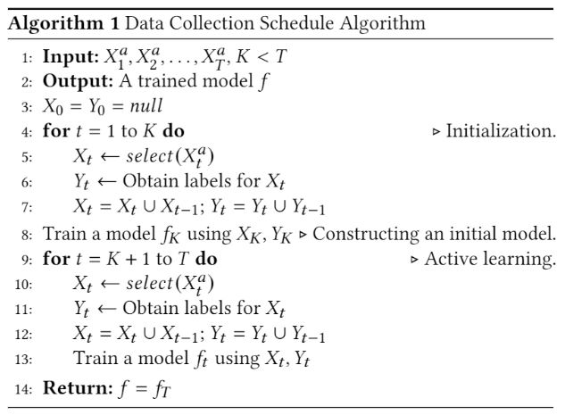

# ActiveLearningForRegression

## Prerequisites:
1. [Anaconda 3](https://www.anaconda.com/download/)
2. [modAL](https://modal-python.readthedocs.io/en/latest/)
3. [xgboost](https://github.com/dmlc/xgboost)

## Getting Started

1. Pip install [modAL](https://pypi.org/project/modAL/) package: (`pip install modAL`)
2. Pip install [xgboost](https://pypi.org/project/xgboost/) package: (`pip install xgboost`)
3. Clone this [repository](https://github.com/nitaytech/ActiveLearningForRegression): `git clone https://github.com/nitaytech/ActiveLearningForRegression.git`
4. Open the `MACROS.py` file and update the variables in this file according to your reserach needs. The file contains a description of each variable.
5. Run the `main.py` file: `python3 main.py`
6. The results will appear in the [results](https://github.com/nitaytech/ActiveLearningForRegression/results) folder.
7. Use the [notebook](https://github.com/nitaytech/ActiveLearningForRegression/results) to analyze the results.

## The Data
We have uploaded a data file (`data/milk_sessions.csv`) which contains real features of milking sessions of cows. Note that the results of the paper cannot be reproduced by this data file, since we have ommited additional features which we could not disclose for busniess reasons.

### Data Schema (columns):
|A                                                          |B                                         |C                                  |
|-----------------------------------------------------------|------------------------------------------|-----------------------------------|
|Feature                                                    |Annotation                                |Remarks                            |
|DailyYield_KG                                              |Daily production milk (kg)                |sensor data                        |
|DailyFat_P                                                 |daily fat %                               |sensor data                        |
|DailyProtein_P                                             |daily protein %                           |sensor data                        |
|DailyConductivity                                          |Daily milk conductivity (avg)             |sensor data                        |
|DailyActivity                                              |motion sensors data accumulated energy    |                                   |
|CurrentRP                                                  |Retained placenta (post partum desease)   |two categories                     |
|CurrentMET                                                 |Metritis (post partum desease)            |two categories                     |
|CurrentKET                                                 |ketosis (energy balance disorder)         |two categories                     |
|CurrentMF                                                  |milk fever - post partum                  |two categories                     |
|CurrentPRO                                                 |Edma of current - post partum             |two categories                     |
|CurrentLDA                                                 |displaced abomasum - post partum          |two categories                     |
|CurrentMAST                                                |Mastitis                                  |two categories                     |
|CurrentEdma                                                |rare post partum desease                  |two categories                     |
|CurrentLAME                                                |lameness                                  |two categories                     |
|Desease                                                    |one of the above                          |                                   |
|DIM                                                        |DIM - days in milk (Day from calving)     |                                   |
|DIM_<50', 'DIM_50-175', 'DIM_>=175' - an indicator (0 or 1)|3 classes for DIM                         |                                   |
|LactationNumber                                            |                                          |number of calvings                 |
|Fertility number                                           |genycological status                      |categories(pregnant, on heat, etc…)|
|Age                                                        |age in months                             |                                   |
|Twin                                                       |Twin birth                                |two categories                     |
|Still                                                      |Still birth                               |                                   |
|Fat                                                        |FatDaily                                  |milk components                    |
|Protein                                                    |ProteinDaily                              |milk components                    |
|Lactose                                                    |LactoseDaily                              |milk components                    |
|LogScc                                                     |log10 somatic cell count                  |milk components                    |
|Cf                                                         |Curd firmness - milk coagulation potential|milk components                    |
|BloodDaily                                                 |BloodDaily                                |milk components                    |
|failed tryout for urea                                     |Component7Daily                           |milk components                    |
|CaseinDaily                                                |CaseinDaily                               |milk components                    |
|Mufa                                                       |mono un saturated fatty acids             |milk components                    |
|Pufa                                                       |poly un saturated fatty acid              |milk components                    |
|Sfa                                                        |Saturated fatty acids                     |milk components                    |
|Ufa                                                        |unsaturated fatty acids                   |milk components                    |
|Pa                                                         |Palamitic acid                            |milk components                    |
|Sa                                                         |Salicitic acid                            |milk components                    |
|Oa                                                         |Oleic acid                                |milk components                    |

## The Paper
Paper is under review.
[Technical report](https://github.com/nitaytech/ActiveLearningForRegression/blob/main/Tech-Report.pdf)

**BibTeX**:
T.B.A
