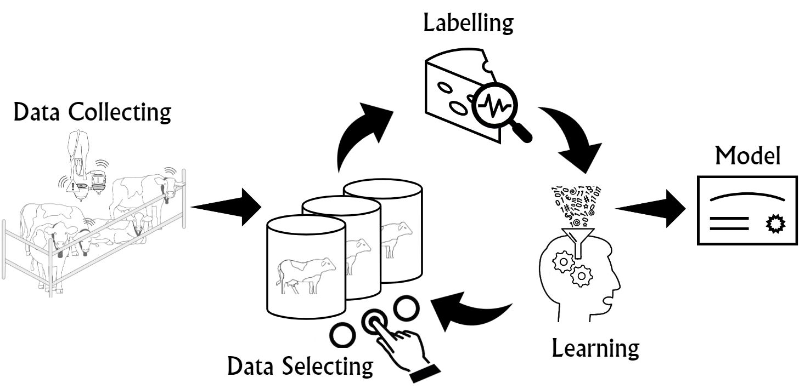

# ActiveLearningForRegression

## Prerequisites:
1. [Anaconda 3](https://www.anaconda.com/download/)
2. [modAL](https://modal-python.readthedocs.io/en/latest/)

## Getting Started

1. Pip install [modAL](https://pypi.org/project/modAL/) package: (`pip install modAL`)
2. Clone this [repository](https://github.com/nitaytech/ActiveLearningForRegression): `git clone https://github.com/nitaytech/ActiveLearningForRegression.git`
3. Open the `MACROS.py` file and update the variables in this file according to your reserach needs.
4. Run the `main.py` file: `python3 main.py`
5. The results will appear in the [results](https://github.com/nitaytech/ActiveLearningForRegression/results) folder, there you will find a [notebook](https://github.com/shraga89/DSMA/blob/master/results/analysis.ipynb) to help you analyze the results.

## The Data
We have uploaded a data file (`milk_sessions.csv`) which contains real features of milking sessions of cows. Note that the results of the paper cannot be reproduced by this data file, since we have ommited additional features which we could not disclose for busniess reasons.

### Data Schema (columns):
* Date
* CowID
* DailyYield_KG
* DailyFat_P
* DailyProtein_P
* DailyConductivity
* DailyActivity
* DailyRestPerBout
* DailyRestRatio
* CurrentRP / CurrentMET / CurrentKET / CurrentMF / CurrentPRO / CurrentLDA / CurrentMAST / CurrentEdma / CurrentLAME
* DIM
* LactationNumber
* Fertility_Num
* BCSAtCalving
* Age
* Still
* Milk
* MilkTemperature
* Fat / Protein / Lactose
* LogScc
* Cf
* Blood
* ComponentSeven
* Casein
* Mufa
* Pufa
* Sfa
* Ufa
* Pa
* Sa
* Oa

## The Paper

**BibTeX**:

